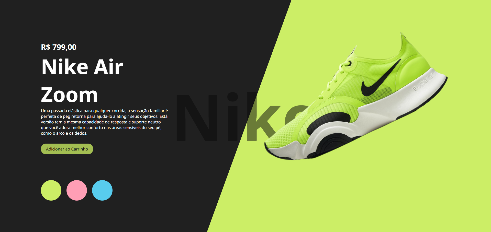
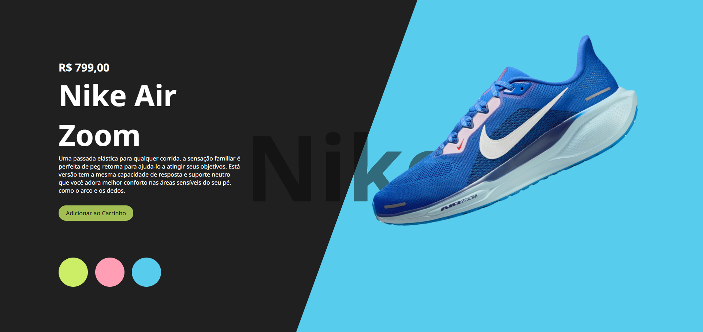

📌 Nike Air Zoom - Landing Page

Uma página de produto interativa para o tênis Nike Air Zoom, permitindo a troca de cores e exibindo informações detalhadas sobre o produto.

🚀 Tecnologias utilizadas

HTML

CSS

JavaScript

📥 Como clonar o repositório

1️⃣ Clone o repositório
bash
Copiar
Editar
git clone https://github.com/seu-usuario/seu-repositorio.git

(⚠️ Substitua seu-usuario e seu-repositorio pelo nome correto do seu repositório no GitHub.)

2️⃣ Entre na pasta do projeto

bash
Copiar
Editar
cd nome-da-pasta

3️⃣ Abra o arquivo index.html no navegador

Se quiser rodar um servidor local, utilize o Live Server no VS Code ou rode um servidor simples com o Python:

bash
Copiar
Editar
# Para Python 3:

python -m http.server
Acesse http://localhost:8000/ no navegador.

## 📸 Screenshots  
Aqui estão algumas imagens do projeto:

### 🟢 Versão Verde  

### 🔵 Versão Azul  

📌 Funcionalidades

✅ Exibição do tênis em diferentes cores

✅ Design responsivo

✅ Botão de adicionar ao carrinho

🔗 Link do projeto

🔗 Deploy do projeto: https://alvarodev12.github.io/Nike-Air-Zoom-Landing-Page/
